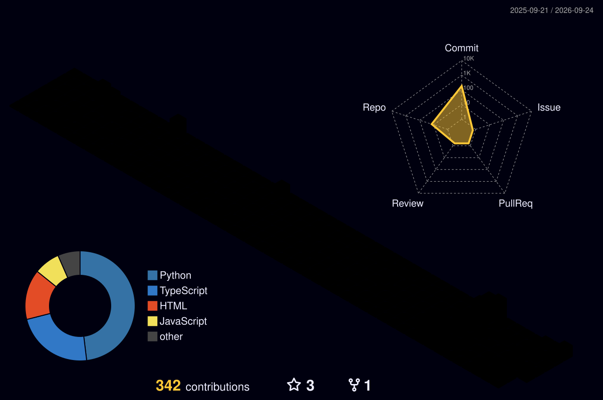

<!-- ============================== HERO ============================== -->

<div align="center">


<a href="https://github.com/Kushall-07">
  
</a>

<br/>

<a href="https://github.com/Kushall-07">

</a>

<a href="https://linkedin.com/in/kushalkumarpi">

</a>

<a href="mailto:kushalk283@gmail.com">

</a>

<a href="https://leetcode.com/u/KushalKumarPI/">

</a>

<a href="https://instagram.com/kushall_07">

</a>

<br/><br/>


</div>

---

## `$ whoami`

I'm **Kushal Kumar P I**, a Computer Science Engineering undergraduate focused on **AI Engineering, Agentic AI, Machine Learning, Computer Vision, Backend Engineering and System Design**.

I enjoy building systems where intelligent models are connected to real software infrastructure — from **multi-agent decision systems and LLM applications** to **medical imaging, document intelligence and full-stack applications**.

* 🤖 **AI Engineering** — LLMs, RAG, tool calling, agentic systems and multi-agent architectures
* 🧠 **Machine Learning** — Deep Learning, Computer Vision, medical image segmentation and model evaluation
* 📚 **Document Intelligence** — RAG, semantic retrieval, reranking, classification and AI tutoring
* 🌐 **Software Engineering** — React, Next.js, FastAPI, Node.js and REST APIs
* 🗄️ **Data & Infrastructure** — PostgreSQL, PostGIS, MongoDB, Docker and Git
* 🎓 **Computer Science Engineering** — building strong foundations in DSA, systems and software architecture

> **Model → Agent → API → System** — I like building the complete pipeline.

<br/>

---

<div align="center">

<table>
<tr>

<td align="center">

<b>🤖 AI / ML</b><br/>
LLMs · RAG · Agentic AI · Computer Vision

</td>

<td align="center">

<b>🧩 AI Engineering</b><br/>
Agents · Tool Calling · LangGraph · Orchestration

</td>

<td align="center">

<b>🌐 Full-Stack</b><br/>
React · Next.js · FastAPI · Node.js

</td>

<td align="center">

<b>⚙️ Systems</b><br/>
PostgreSQL · PostGIS · Docker · REST APIs

</td>

</tr>
</table>

</div>

<br/>

---

# 🚀 Featured Projects

<table>
<tr>

<td width="50%" valign="top">

<h3>
<a href="https://github.com/Kushall-07/ORCA">
🌊 ORCA
</a>
</h3>

<p>
<b>Oceanic Reasoning & Collaborative Agents</b>
</p>

<p>
AI-powered marine decision-support platform that combines ocean, weather, fisheries, satellite and geospatial information through specialized AI agents.
</p>

<p>


</p>

<sub>
Python · FastAPI · LangGraph · React · TypeScript · PostgreSQL · PostGIS · GeoPandas · Shapely
</sub>

<br/><br/>

<a href="https://github.com/Kushall-07/ORCA">

</a>

</td>

<td width="50%" valign="top">

<h3>
<a href="https://github.com/Kushall-07/brain-tumor-segmentation">
🧠 Brain Tumor Segmentation
</a>
</h3>

<p>
<b>AI-Assisted Medical Imaging</b>
</p>

<p>
Deep learning pipeline for multi-modal MRI brain tumor segmentation using volumetric medical imaging and a 3D U-Net workflow.
</p>

<p>


</p>

<sub>
Python · PyTorch · MONAI · Nibabel · 3D U-Net · FastAPI · REST API
</sub>

<br/><br/>

<a href="https://github.com/Kushall-07/brain-tumor-segmentation">

</a>

</td>

</tr>

<tr>

<td width="50%" valign="top">

<h3>
<a href="https://github.com/Kushall-07/AI-COURSE-BUILDER">
📚 AI Course Builder
</a>
</h3>

<p>
<b>AI-Powered Learning Platform</b>
</p>

<p>
A full-stack AI application for generating structured educational courses with LLMs and persistent course management.
</p>

<p>


</p>

<sub>
Next.js · React · Grok · Clerk · Drizzle ORM · Neon PostgreSQL
</sub>

<br/><br/>

<a href="https://github.com/Kushall-07/AI-COURSE-BUILDER">

</a>

</td>

<td width="50%" valign="top">

<h3>
<a href="https://github.com/Kushall-07/rsg-sphere">
📚 RAGSphere
</a>
</h3>

<p>
<b>Offline AI Study Companion</b>
</p>

<p>
An intelligent local AI study companion that combines Retrieval-Augmented Generation, document intelligence and an AI tutor to help students learn from their own study materials privately and offline.
</p>

<p>


</p>

<sub>
Python · Streamlit · ChromaDB · Ollama · SentenceTransformers · PyTorch · scikit-learn · BM25
</sub>

<br/><br/>

<a href="https://github.com/Kushall-07/rsg-sphere">

</a>

</td>

</tr>

<tr>

<td width="50%" valign="top">

<h3>
<a href="https://github.com/Kushall-07/SyncGuard">
🛡️ SyncGuard
</a>
</h3>

<p>
<b>Software & Backend Engineering</b>
</p>

<p>
A systems-oriented project focused on reliable application workflows, synchronization and software engineering patterns.
</p>

<p>


</p>

<sub>
Backend Systems · APIs · Synchronization · Software Engineering
</sub>

<br/><br/>

<a href="https://github.com/Kushall-07/SyncGuard">

</a>

</td>

<td width="50%" valign="top">

<h3>
📡 IoT Energy Monitoring System
</h3>

<p>
<b>IoT + Real-Time Monitoring</b>
</p>

<p>
Low-cost IoT system using an ESP32 and current sensing to estimate appliance energy consumption and transmit measurements to a dashboard.
</p>

<p>


</p>

<sub>
ESP32 · Sensors · Wi-Fi · Energy Monitoring · Dashboard
</sub>

<br/><br/>

<a href="https://github.com/Kushall-07?tab=repositories">

</a>

</td>

</tr>
</table>

---

# 💡 Current Focus

<table>
<tr>

<td width="50%" valign="top">

### 🤖 AI & Intelligent Systems

* Large Language Models
* Retrieval-Augmented Generation
* Tool Calling
* Agentic AI
* Multi-Agent Systems
* LangGraph
* AI Orchestration
* AI Evaluation

</td>

<td width="50%" valign="top">

### 🧠 Machine Learning

* Deep Learning
* Computer Vision
* Medical Image Analysis
* Remote Sensing
* Model Evaluation
* Data Preprocessing
* PyTorch
* MONAI

</td>

</tr>

<tr>

<td width="50%" valign="top">

### ⚙️ Software Engineering

* React / Next.js
* FastAPI
* Node.js
* REST API Development
* Backend Architecture
* PostgreSQL
* PostGIS
* Full-Stack Applications

</td>

<td width="50%" valign="top">

### 🏗️ Systems & Infrastructure

* System Design
* Distributed Systems
* Database Design
* Docker
* Git & GitHub
* API Architecture
* Cloud Deployment
* Production AI Systems

</td>

</tr>
</table>

---

# 🛠️ Technical Skills

## 🤖 AI / Machine Learning

<p>

</p>

<p>


</p>

---

## 🧩 AI Engineering

<p>


</p>

---

## 🌐 Web & Full-Stack

<p>

</p>

---

## 🗄️ Databases & Infrastructure

<p>

</p>

<p>


</p>

---

## 💻 Languages & Tools

<p>

</p>

---

# 📊 GitHub Statistics

<p align="center">


</p>

<p align="center">


</p>

---

# 📈 Contribution Activity

<p align="center">



</p>

---

# 🐍 Contribution Snake

<p align="center">


</p>

---

# 💻 Coding & Problem Solving

<p align="center">

<a href="https://leetcode.com/u/KushalKumarPI/">

</a>

</p>

I’m continuously improving my **Data Structures & Algorithms, problem-solving skills and Computer Science fundamentals** alongside AI engineering.

---

# 🎯 Engineering Direction

<div align="center">

```text
Programming
     ↓
Machine Learning
     ↓
Deep Learning
     ↓
LLMs
     ↓
RAG + Tool Calling
     ↓
Agentic AI
     ↓
Multi-Agent Systems
     ↓
AI + Backend Engineering
     ↓
System Design
     ↓
Production AI Systems
